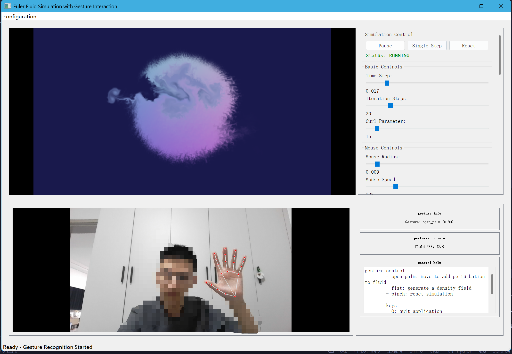
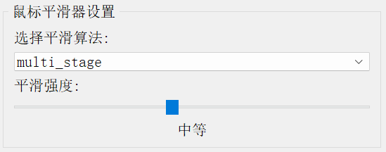

# 流体模拟与手势交互应用
一个基于 Taichi 的高性能流体模拟应用，结合 MediaPipe 手势识别实现直观的交互控制，使用 PyQt5 构建用户界面

(流体模拟代码来源于Taichi的官方示例：
https://github.com/taichi-dev/taichi/blob/master/python/taichi/examples/simulation/eulerfluid2d.py)

## 项目简介
> 本项目实现了一个实时流体模拟系统，通过摄像头捕捉手势动作来交互控制流体行为。用户可以通过张开手掌、握拳、捏合等手势对流体施加力、添加密度或重置模拟，提供直观自然的交互体验 
> 1. 运行环境：
python >= 3.9.0, Microsoft Windows 
Taichi：高性能数值计算，用于流体物理模拟
MediaPipe：手势识别与手部关键点检测
PyQt5：图形用户界面与交互管理
OpenCV：摄像头捕获与图像处理
NumPy：数据处理与数值计算
> 2. 功能
实时流体物理模拟（基于欧拉方法）
手势交互控制（手掌移动、握拳、捏合）
可调节的模拟参数（时间步长、迭代次数、卷曲参数等）
多种预设配置文件，快速切换模拟效果
摄像头实时预览与手势信息显示
支持键盘快捷键操作
>
> 3. 项目结构
> ``` plaintext
> src/
> ├── application/                     # 应用主控制
> │   ├── fluid_gesture_app.py         # 主控制逻辑
> ├── configuration/                   # 配置管理
> │   ├── presets/                     # 预设配置文件(json)
> │   └── config_manager.py            # 配置管理接口
> ├── data/                            # 数据结构定义
> │   ├── image/                       # 图像资源
> │   ├── converters/                  # 图像转换
> │   │   ├── image_converter.py       # 图片转换颜色场接口
> │   ├── fluid_data.py                # 流体模拟数据结构
> │   └── gesture_data.py              # 手势数据结构
> ├── fluid_simulator/                 # 流体模拟核心
> │   ├── fluid_simulator.py           # 流体模拟接口
> ├── gesture_recognition/             # 手势识别相关
> │   ├── camera/                      # 摄像头捕获
> │   │   ├── camera_capture.py        # 摄像头捕获接口
> │   ├── processing/                  # 手势处理
> │   │   └── gesture_classifiction.py # 手势分类接口
> │   └── gesture_recognizer.py        # 手势处理器接口
> ├── interaction/                     # 交互处理
> │   ├── gesture_handler.py           # 手势交互接口
> │   └── mouse_handler.py             # 鼠标交互接口
> ├── renderer/                        # 渲染与界面
> │   ├── camera_preview.py            # 摄像头预览界面渲染
> │   ├── fluid_renderer.py            # 流体界面渲染
> │   └── ui_renderer.py               # 综合主界面渲染
> ├── tests/                           # 功能测试程序
> │   ├── test_interaction.py          # 交互测试
> │   ├── test_rendering.py            # UI渲染测试
> │   ├── test_fluid_simulation.py     # 流体模拟测试
> │   ├── test_image_to_colorfield.py  # 图像转换测试
> │   └── test_gesture_recognition.py  # 手势识别测试
> ├── requirements.txt                 # 依赖配置
> └── main.py                          # 主程序入口
> ```

## 快速开始
> 1. 安装依赖
> ```bash
> pip install -r requirements.txt
> ```
> 在linux下可能需要额外安装qt-wayland，然后设置export QT_QPA_PLATFORM=wayland
> ```
> pip install qt-wayland
> export QT_QPA_PLATFORM=wayland
> ```
=======
> 2. 运行应用
> ```bash
> python main.py
> ```
> 3. 交互控制
> - 打开手掌：对流体扰动
> - 握拳：添加一个密度场
> - 捏合：重置模拟
> - 键盘快捷键：
>> - Q：退出应用
>> - S：保存当前帧
>> - H：显示 / 隐藏帮助面板
>> - P：暂停 / 继续模拟
>> - R：重置模拟
> 4. UI界面
> 
> 5. 配置文件
> 预设配置文件位于 src/configuration/presets 目录下，可根据需要进行修改或添加新的配置文件。
> 6. 注意事项
> 如果你想改变流体的初始形状（颜色场），请修改  [fluid_gesture_app.py](src/application/fluid_gesture_app.py) 中的如下代码，“default”为默认颜色场，输入图片路径可以讲图片转换成颜色场
>> ```python
>> # 加载颜色场
>> # self.simulation.colorfield("src/data/image/Furude Rika.jpg")
>> self.simulation.colorfield("default")
>> ```
> 确保摄像头正确连接并可正常使用
> 手势识别可能存在一定的误识别率，可根据实际情况调整阈值
> 如果你有多个摄像头，可能需要调整 [camera_capture.py](src/gesture_recognition/camera/camera_capture.py) 中的摄像头索引
>> ```python
>> self.camera_id = 0 # 摄像头索引，默认为0
>> self.resolution = resolution
>> self.cap = None
>> self.running = False
>> self.last_frame = None
>> self.lock = threading.Lock()
>> self.thread = None
>> ```

## 效果演示（最终效果）
以下 GIF 展示了本应用的核心交互效果，包括：
- 带彩色颜色场的实时流体模拟渲染效果
- 张开手掌手势：对流体施加作用力，扰动流体运动
- 握拳手势：添加密度场，丰富流体纹理细节
- 捏合手势：将模拟重置至初始状态
- UI 界面中实时的摄像头预览与手势关键点追踪


> 注意：
> - 该 GIF 为适配 GitHub 展示进行了压缩处理，实际运行时帧率更高、交互更流畅；
> - 演示中启用了光标平滑优化（贝塞尔曲线 + 卡尔曼滤波），可显著降低 30 FPS 摄像头输入下手部追踪的抖动问题。

## 特点
1. 主要流体模拟算法来自 Taichi 的官方示例：https://github.com/taichi-dev/taichi/blob/master/python/taichi/examples/simulation/eulerfluid2d.py
在此基础上增加了一些影响变量和可调节的参数

2. 6 个核心场：速度场、颜色场、压力场、温度场、密度场、涡度场
   7 步完整流程：平流→扩散→浮力→耗散→涡度→压力→交互

3. 手势识别功能使用mediapipe与opencv联合实现，手势交互（张开手掌移动，握拳，两指捏合） 和 鼠标交互（鼠标移动，点击）

4. 换用录制帧率更高的摄像头会有更好的手势捕捉效果，本人的笔记本是30pfs的摄像头，捕捉效果不甚理想，导致cursor的位置相对跳跃不连续

5. 对于摄像头捕捉的优化，在UI中右边的参数面板下拉可以找到 
    支持切花鼠标插值算法，默认为混合算法（贝塞尔曲线插值与Kalma滤波器联合平滑），通过这些算法部分弥补了摄像头录制帧率低所带来的影响

6. UI界面全部使用PyQt5绘制，没有使用Taichi中的原生UI或Taichi的ggui，流体运行的帧数可以维持在40~50帧（AMD HX370 + NVIDIA RTX4060 Laptop + 32G RAM），基本满足实时运行需求 
